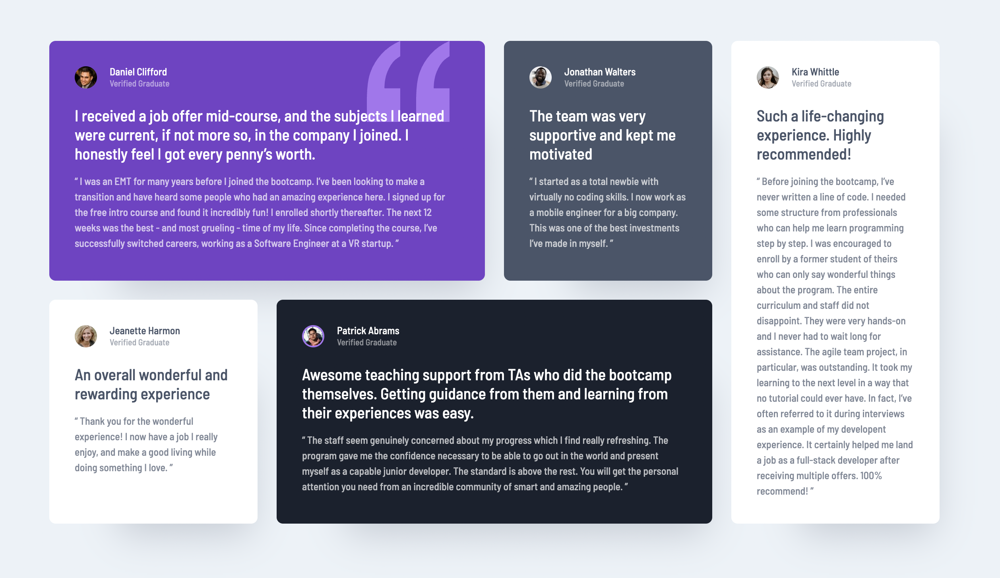

# Frontend Mentor - Testimonials grid section solution

This is a solution to the [Testimonials grid section challenge on Frontend Mentor](https://www.frontendmentor.io/challenges/testimonials-grid-section-Nnw6J7Un7). Frontend Mentor challenges help you improve your coding skills by building realistic projects. 

## Table of contents

- [Overview](#overview)
  - [The challenge](#the-challenge)
  - [Screenshot](#screenshot)
  - [Links](#links)
- [My process](#my-process)
  - [Built with](#built-with)
  - [What I learned](#what-i-learned)
  - [Continued development](#continued-development)

- [Author](#author)
- [Acknowledgments](#acknowledgments)

## Overview

### The challenge

Users should be able to:

- View the optimal layout for the site depending on their device's screen size
- I was more focused on using this as a way to get better at CSS Grid. 

### Screenshot

### Links

- Solution URL: (https://github.com/MorganEJLA/css-grid-practice)
- Live Site URL: (https://morganejla.github.io/css-grid-practice/)

## My process
I did a code along on YouTube, as I needed a refresher in CSS Grid, one of the things that I took away from this was using the Layout tab in the Dev Tools. 
### Built with

- Semantic HTML5 markup
- CSS custom properties
- grid-template-areas

### What I learned

This was just a exercise on dealing with different types of grids and doing it in a simple way. 

### Continued development
Using the Dev Tools and the Layout Grid has been something that I have not done before so this is something I would like to make a habit of in future front end mentor challenges.

### Useful resources

## Author

- Frontend Mentor - [@MorganEJLA](https://www.frontendmentor.io/profile/MorganEJLA)

**Note: Delete this note and add/remove/edit lines above based on what links you'd like to share.**

## Acknowledgments

Kevin Powell Walkthru